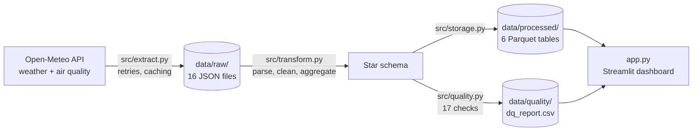

# City Operations Risk Monitor

An end-to-end data product that measures **weather and air-quality disruption risk** across 8 major Indian cities, so an operations or logistics planner can see **where and when to plan buffers**: extra staff, delivery slack, or outdoor-work restrictions.

**Pipeline:** free public API → raw JSON snapshot → Python ETL (clean, model, validate) → Parquet star schema + data-quality report → Streamlit dashboard.

| | |
|---|---|
| **API** | [Open-Meteo](https://open-meteo.com/): Historical Weather API and Air Quality API. **Free, no API key, no sign-up.** |
| **Scope** | 8 cities (Delhi, Jaipur, Mumbai, Ahmedabad, Kolkata, Chennai, Bengaluru, Hyderabad) · daily grain · 1 Oct 2024 – 30 Sep 2026 (730 days) |
| **Stack** | Python · requests · pandas · pyarrow (Parquet) · Streamlit · Plotly · pytest |
| **Tests** | 33 unit tests (`pytest`) |
| **Data quality** | 17 automated checks, written to `data/quality/dq_report.csv` and shown in the dashboard |

---

## 1. How to run

Requires **Python 3.10+** (developed and tested on Python 3.14, Windows 11). No API key, Docker, database or manual data preparation.

```bash
git clone <repository-url>
cd <repository-folder>
python -m venv .venv
# Windows: .venv\Scripts\activate
# macOS/Linux: source .venv/bin/activate
pip install -r requirements.txt
python etl.py
streamlit run app.py
```

The dashboard opens at <http://localhost:8501>. Stop it with **Ctrl+C**.

**Notes**
- `python etl.py` takes about 1 second when the raw snapshot in `data/raw/` is present. It only calls the API for files that are missing.
- `python etl.py --refresh` forces a fresh download from Open-Meteo (16 API calls, about 30 seconds).
- `python etl.py --strict` exits with code 2 if any ERROR-level data-quality check fails (useful for scheduling or CI).
- `pytest` runs the test suite.

---

## 2. Business problem and product

**User:** an operations or logistics planner who runs field teams or deliveries across Indian cities.

**Questions the dashboard answers**
1. Which cities and months carry the most disruption risk?
2. What drives it: heat, heavy rain or poor air?
3. Is risk seasonal, and is it getting better or worse year on year?
4. How far can we trust the data?

**Risk definitions** (all defaults in `src/config.py`, all adjustable in the dashboard)

| Flag | Rule | Basis |
|---|---|---|
| Heat day | daily max temperature ≥ **40 °C** | IMD heatwave criterion for the plains (simplified) |
| Heavy-rain day | daily rainfall ≥ **64.5 mm** | IMD "heavy rainfall" category |
| Poor-air day | daily mean **PM2.5 > 60** or **PM10 > 100** µg/m³ | India NAAQS 24-hour standards |
| Disruption day | any *included* flag is true | combined operational indicator |

**Disruption rate** = disruption days ÷ city-days with weather data. **Main risk driver** = the risk type with the most flagged days.

### Key findings (default thresholds, all cities, full period)
- **27% of city-days** (1,559 of 5,840) carry at least one risk.
- **Poor air drives 85% of risk-days** (1,425 of 1,672). Delhi alone accounts for 41% of poor-air days (591 days, 81% of its days).
- **Heat is concentrated in the west and north:** Ahmedabad has 47% of all heat days (106), followed by Delhi (60) and Jaipur (52). Bengaluru and Mumbai have none.
- **Risk peaks in winter** (35% of city-days) because of smog, and is lowest in the monsoon (15%), when rain clears the air.
- **With "Poor air" unticked**, weather-only disruption falls to roughly 4% of city-days and heat becomes the main driver. The headline number is therefore mostly an air-quality story, which is why the dashboard lets planners choose which risks count.

---

## 3. Architecture



`etl.py` runs four stages: **Extract → Transform → Quality checks → Load**.

| Stage | Module | What it does |
|---|---|---|
| Extract | `src/extract.py` | Calls both APIs for each city (16 calls). **Retries** timeouts, connection errors and HTTP 429/5xx with exponential backoff (2 s, 4 s, 8 s). **Does not retry** HTTP 4xx, because a bad request will not fix itself. Saves each response with request metadata, writing to a temp file first so a crash never leaves a half-written file. **Caches** valid files so re-runs are instant and reproducible. A failed city is logged and skipped, never fatal, and every outcome is written to `_extract_manifest.json`. |
| Transform | `src/transform.py` | Parses JSON into tables, drops duplicates, turns physically impossible values into null (never clipped), averages hourly air quality into daily values, builds dimensions and facts, adds risk flags, and builds the monthly mart. Every function is pure (DataFrame in, DataFrame out), so it is unit-testable. |
| Quality | `src/quality.py` | Source checks run **before** cleaning, so the report shows what the API actually sent. Model checks run **after**, to prove the ETL is correct. |
| Load | `src/storage.py` | Parquet for tables (keeps dates, booleans and nulls typed correctly) and CSV for the DQ report (readable on GitHub and in Excel). |
| Analytics | `src/analytics.py` | Filters, KPIs and generated insights for the dashboard. It reuses the ETL's flag and mart functions, so the dashboard and pipeline always share one definition of each metric. |
| Settings | `src/config.py` | Cities, dates, API settings, thresholds and validity ranges, all in one place. |

### Repository structure
```
├── README.md
├── requirements.txt
├── etl.py                  # ETL entry point
├── app.py                  # Streamlit dashboard
├── pytest.ini
├── src/
│   ├── config.py           # all settings and thresholds
│   ├── extract.py          # API -> data/raw
│   ├── transform.py        # raw -> star schema
│   ├── quality.py          # 17 data-quality checks
│   ├── storage.py          # read/write helpers
│   └── analytics.py        # KPIs and insights for the app
├── tests/                  # 33 unit tests
├── data/
│   ├── raw/                # API snapshot (JSON) – committed for reproducibility
│   ├── processed/          # Parquet tables – rebuilt by etl.py
│   └── quality/            # dq_report.csv
├── docs/                   # data model diagram and specification
└── ai_transcript/          # full AI conversation
```

---

## 4. Data model

A star schema with two dimensions, two source facts, one integrated fact, one monthly mart and a data-quality log. Full attribute-level detail is in `docs/`.

| Table | Grain | Key | Rows |
|---|---|---|---|
| `dim_city` | city | `city_id` | 8 |
| `dim_date` | day (with month, quarter, IMD season, weekend) | `date` | 730 |
| `fact_weather_daily` | city × day | `city_id, date` | 5,840 |
| `fact_air_quality_daily` | city × day (aggregated from hourly) | `city_id, date` | 5,840 |
| `fact_city_daily` | city × day: weather + air quality + risk flags | `city_id, date` | 5,840 |
| `mart_city_month` | city × month KPIs | `city_id, year_month` | 192 |
| `dq_report` | check × ETL run | `run_id, check_id` | 17 |

**Design decisions**
- **Calendar spine.** `fact_city_daily` is built as *every city × every date*, left-joined to both sources. A day missing from either source, or both, stays visible (`has_weather` / `has_air_quality` = False) instead of silently disappearing, as it would in a plain inner join.
- **Unknown is not "no".** If the input is missing, the flag is null, not False. A missing temperature is never counted as "not a heat day".
- **Air-quality completeness rule.** A daily PM average is only trusted with **≥ 18 of 24** hourly readings (75%).
- **Disruption is configurable.** All three flags are always stored; the dashboard decides which ones count towards a disruption day.

---

## 5. Data quality and validation

17 checks run on every ETL run. **Status rules:** PASS = nothing found; **WARN** = issue found and handled (visible in the dashboard); **FAIL** = output should not be trusted.

| ID | Table | Check | Type | Severity |
|---|---|---|---|---|
| DQ_SRC_01 | raw | Raw file present and readable for every city × source | availability | ERROR |
| DQ_WX_01 | weather (raw) | Duplicate city-date rows (dropped, first kept) | uniqueness | WARN |
| DQ_WX_02 | weather (raw) | Missing days in the expected date range | completeness | WARN |
| DQ_WX_03 | weather (raw) | Null values in weather measures | completeness | WARN |
| DQ_WX_04 | weather (raw) | Values outside plausible range (set to null) | validity | WARN |
| DQ_WX_05 | weather (raw) | temp_min ≤ temp_mean ≤ temp_max | consistency | WARN |
| DQ_AQ_01 | air quality (hourly) | Duplicate city-hour rows | uniqueness | WARN |
| DQ_AQ_02 | air quality (hourly) | Null PM2.5 / PM10 readings | completeness | WARN |
| DQ_AQ_03 | air quality (hourly) | Readings outside plausible range | validity | WARN |
| DQ_AQ_04 | air quality (hourly) | PM2.5 ≤ PM10 (PM2.5 is a subset of PM10) | consistency | WARN |
| DQ_AQ_05 | fact_air_quality_daily | Days with < 18 valid hours | completeness | WARN |
| DQ_FC_01 | fact_city_daily | Primary key unique | uniqueness | ERROR |
| DQ_FC_02 | fact_city_daily | Every city_id exists in dim_city | referential integrity | ERROR |
| DQ_FC_03 | fact_city_daily | Every date exists in dim_date | referential integrity | ERROR |
| DQ_FC_04 | fact_city_daily | Row count = cities × days | completeness | ERROR |
| DQ_FC_05 | fact_city_daily | Days missing one or both sources | join coverage | WARN |
| DQ_MART_01 | mart_city_month | Monthly totals reconcile to the daily fact | consistency | ERROR |

**Result on the current data: 17 PASS, 0 WARN, 0 FAIL.** Open-Meteo serves gridded model output, which is naturally complete. To prove the checks actually catch problems, the test suite feeds them deliberately broken data (duplicates, gaps, a 99 °C reading, PM2.5 above PM10, orphan keys, an unreconciled mart) and asserts that each one is detected.

**Beyond the automated checks: a real-world sanity check.** Passing checks prove the data is well-formed, not that it is right, so I compared results with known climate patterns. Heat ranked Ahmedabad > Delhi > Jaipur with none in Bengaluru or Mumbai, and poor air ranked Delhi highest; both as expected. Heavy rain, however, was clearly **under-counted** (Mumbai 13 days over two monsoons, Kolkata 0). See limitation 1 below.

**Error handling**
- API errors: retry with backoff, then log and continue with the other cities.
- Corrupt cache file: detected and downloaded again.
- No usable data at all: the ETL stops with a clear message (exit code 1).
- Missing processed data: the dashboard shows "Run `python etl.py` first" instead of crashing.
- Empty filter selections: the dashboard shows a prompt instead of an error.

---

## 6. Dashboard

`streamlit run app.py` reads only the processed outputs and never calls the API.

- **Sidebar:** region, city and period filters; **Risks included** checkboxes (for example, untick Poor air for weather-only disruption); **threshold sliders** for heat, rain, PM2.5 and PM10, so a planner can test sensitivity.
- **KPI row:** disruption days, disruption rate, most exposed city, main risk driver, air-quality coverage.
- **Overview:** plain-English insights generated from the data (no hard-coded numbers), a city × month disruption heatmap, and risk-days by city split by type.
- **Trends & seasonality:** monthly risk-days per type and a profile by IMD season.
- **City deep-dive:** daily temperature, rainfall and PM2.5 for one city, each on its own chart with its threshold line.
- **Data quality:** the latest DQ report, coverage by city, and known limitations.
- **Data explorer:** filtered monthly and daily tables with CSV download.

Charts use a colour-blind-safe palette with one fixed colour per risk type in both light and dark themes, and never put two measures on one chart with two y-axes.

---

## 7. Assumptions and known limitations

1. **Heavy rain is under-counted.** Open-Meteo's historical weather is reanalysis model output on a grid roughly 10–25 km wide. Averaging over a grid cell smooths out local cloudbursts, so the gauge-based IMD threshold of 64.5 mm triggers far less often than at a real rain gauge. I kept 64.5 mm as the default because it is the official, defensible definition, and added a slider so users can test lower values.
2. **Model data, not ground stations.** Air quality comes from the CAMS model, not CPCB monitoring stations.
3. **One coordinate per city.** Conditions vary across large cities.
4. **Simplified heat rule.** IMD also uses departure from normal temperature; a fixed 40 °C is used here.
5. **"Main driver" means most frequent, not most severe.** A flooded day and a poor-air day each count as one day. The *Risks included* toggle mitigates this.
6. **Fixed historical window** (Oct 2024 – Sep 2026). Not a live or forecast feed.
7. **Data in Git.** The raw API snapshot is committed so the project runs even if the API is unavailable, and so the analysis is reproducible. Processed tables are not committed because `etl.py` rebuilds them in about a second.

---

## 8. How AI was used

I used an AI assistant (Claude) throughout. The full conversation is in [`ai_transcript/`](ai_transcript/). AI wrote most of the code. I set the direction, made the decisions, ran everything on my machine, and checked the results against reality.

**How I worked with it**
- **Breaking down the assignment.** I asked for a 6-step plan with the installs needed at each step, to organise my time. I chose to work step by step rather than have the whole project generated at once, so each part could be run and checked before moving on.
- **Choosing the API and design.** I tested the API in the browser and with Python before committing to it, and asked for the data model as a diagram so I could review it.
- **Accepting or rejecting suggestions.** I went with the AI's recommendations where they were reasoned (no wind flag; the 18-of-24-hours air-quality rule), and pushed for changes where the product needed them. The *Risks included* toggle came from questioning whether an 85% poor-air share made the headline number misleading.
- **Questioning the numbers.** I asked how disruption rate and main driver are calculated, step by step, before accepting them for this README.

**Where review caught real issues**
- **Wrong threshold:** the first plan used 50 mm for heavy rain; this was corrected to IMD's official 64.5 mm before any code was written.
- **Plausibility check:** comparing results with known climate patterns exposed the rainfall under-counting (limitation 1). The fix was a slider and documentation, not quietly lowering the official threshold.
- **Severity calibration:** raw duplicates were first marked FAIL, but the pipeline already fixes them, so they were downgraded to WARN. FAIL is reserved for problems in the final tables.
- **Portability:** exact package pins (pandas 3.x needs Python 3.11+) would have broken installs for reviewers on older Python, so `requirements.txt` uses tested minimum versions instead. The code was tested on both pandas 2.3 and 3.0.
- **Deprecations:** Streamlit 1.65 warned about `use_container_width`; this was replaced before submission.
- **Debugging setup issues:** missing folders, a zip extracted into the wrong directory, an unlinked Git remote, and a `.gitignore` that excluded the data were all diagnosed from the terminal output I shared.

---

## 9. What I would improve with more time

- **Severity weighting:** score risks by operational impact (rain > heat > air) instead of counting days equally.
- **Ground-truth validation:** compare against IMD rain gauges and CPCB air-quality stations to calibrate thresholds for model data.
- **Incremental loads:** append new days instead of rebuilding the full window, and schedule a daily run.
- **More risks:** cyclone and high-wind days for coastal cities (wind is already extracted but not yet flagged).
- **DQ history:** keep every run's report to track data quality over time and alert on regressions.
- **Packaging:** a `Makefile`, CI running `pytest` and `etl.py --strict` on every push, and a hosted demo on Streamlit Community Cloud.
